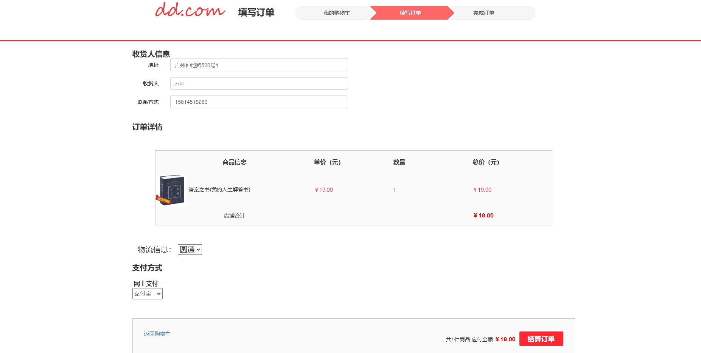
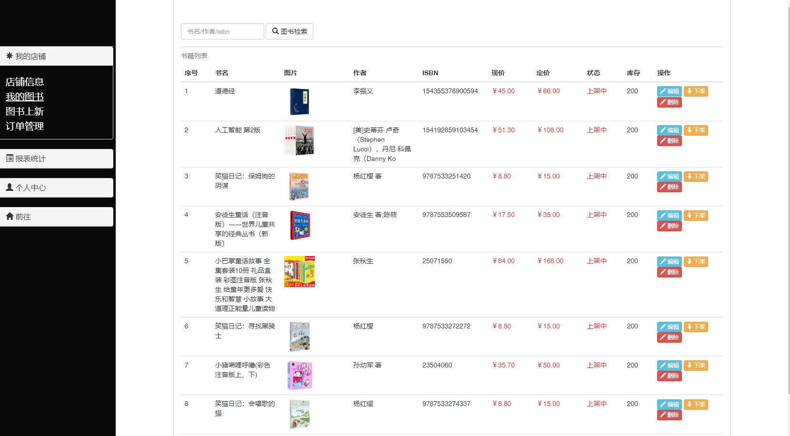
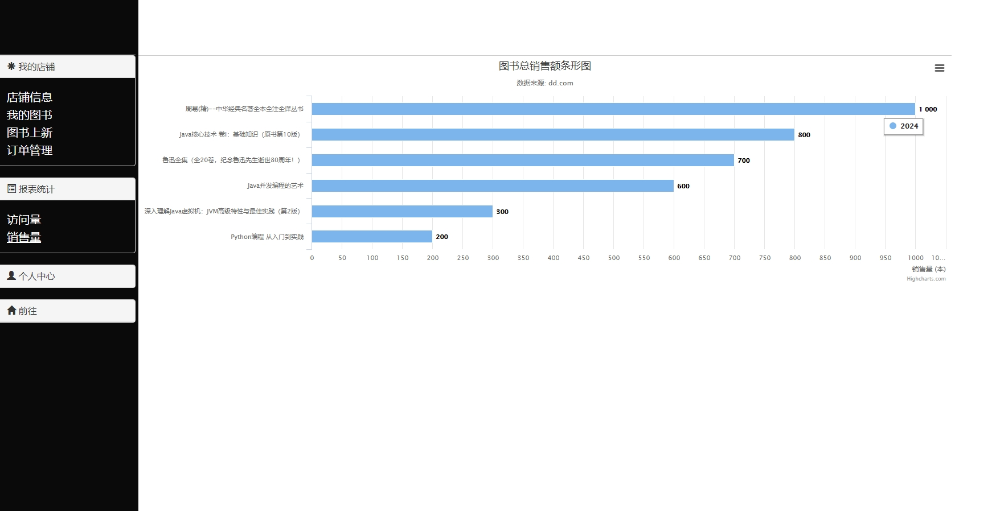

:point_right: [点我获得更多源码](http://blog.cyrobot.top/blog) 
####  1.项目介绍

> 该系统分为前台展示和后台管理两大模块。  

> 前台主要是为消费者服务。该子系统实现了注册，登录，以及从浏览、下单到支付的整个流程，支付使用的  是支付宝的沙箱环境，属于模拟环境。需要注册沙箱账号才能付款。  

>  后台主要是为商家服务，实现了权限，店铺，商品和订单等的管理，以及生成一些简单的报表信息。访  问 /admin   进入后台  

#### 2.依赖环境

> jdk1.8,maven,mysql  

> 注意事项  :在数据库中创建名为 bookstore  数据库,然后运行项目的 resource  目录下的sql脚本，记得在  application.properties  改数据库配置信息  。登录系统的账号和密码，请自行查看数据库下的 user  表 (管理员账号：admin 密码：123，普通商家：  zdd 123)  

> 使用沙箱环境的支付宝才能扫码支付， application.properties  中的my.ip要改成自己，有项目名还要加项目名，否则支付成功回调出错。微信支付功能需要有已上线的项目id以及商家密钥，才能完成整个支付流程，代码逻辑已经实现

3. #### 系统部分截图

